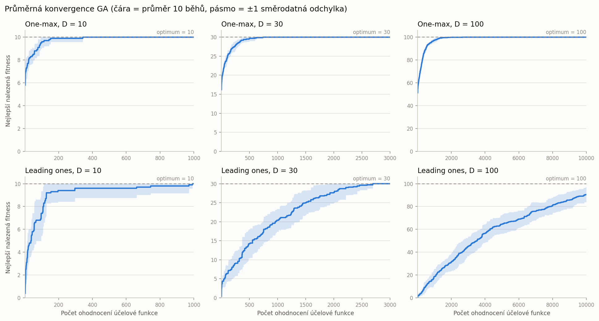
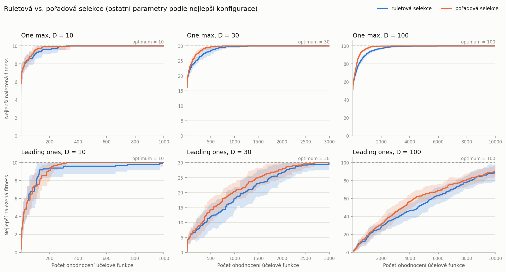
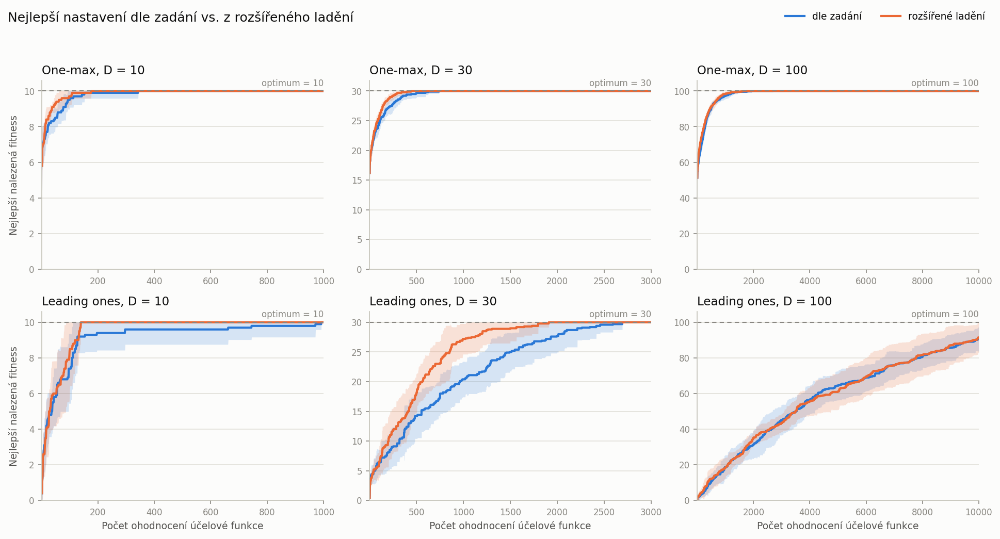

# Úloha 1 – Genetický algoritmus

Genetický algoritmus (GA) s binární reprezentací jedinců, elitismem, ruletovou/pořadovou selekcí, jednobodovým křížením a bitovou mutací. Algoritmus je otestován na úlohách **One-max** a **Leading ones** v dimenzích 10, 30 a 100 s rozpočtem **100·D ohodnocení účelové funkce** (1 000, 3 000 a 10 000).

Řešení má dvě části:

1. **Hlavní výsledky** ([`results/strict/`](results/strict/)) striktně podle zadání: jednobodové křížení, pravděpodobnost mutace 0.5–1 %, elitismus 10–20 %. Ladí se velikost populace, podíl elitismu, typ selekce, pravděpodobnost křížení a mutace.
2. **Doplňkový experiment** ([`results/extended/`](results/extended/)): rozšířené ladění, které zkouší i dvoubodové a uniformní křížení a mutaci pm = 1/D. Ukazuje, co přinese odchýlení od předepsaných operátorů.

Obsah:

- [Struktura řešení](#struktura-řešení)
- [Spuštění](#spuštění)
- [Implementace](#implementace)
- [Ladění parametrů](#ladění-parametrů)
- [Výsledky](#výsledky)
- [Doplňkový experiment: rozšířené ladění](#doplňkový-experiment-rozšířené-ladění)
- [Závěr](#závěr)

## Struktura řešení

```
01-genetic-algorithm/
├── main.py              # vstupní bod (CLI): ladění parametrů, finální experimenty, srovnání
├── ga/                  # samotný algoritmus – nezávisí na konkrétních úlohách ani experimentech
│   ├── config.py        # GAConfig – řídicí parametry algoritmu
│   ├── algorithm.py     # GeneticAlgorithm – generační cyklus s elitismem
│   ├── selection.py     # ruletová a pořadová selekce
│   ├── crossover.py     # jednobodové křížení (+ dvoubodové a uniformní pro doplňkový experiment)
│   ├── mutation.py      # bitová mutace
│   └── evaluator.py     # BudgetedEvaluator – hlídá rozpočet ohodnocení, zaznamenává konvergenci
├── problems/            # účelové funkce
│   ├── base.py          # rozhraní Problem
│   ├── onemax.py        # One-max
│   └── leading_ones.py  # Leading ones
├── experiments/         # vše kolem algoritmu
│   ├── runner.py        # opakované nezávislé běhy
│   ├── statistics.py    # statistiky (nejlepší, nejhorší, průměr, medián, sm. odchylka, …)
│   ├── tuning.py        # mřížky parametrů (strict, extended) a grid search
│   ├── plotting.py      # konvergenční grafy
│   └── tables.py        # export tabulek do CSV a Markdownu
├── tests/               # jednotkové testy (pytest)
└── results/
    ├── strict/          # hlavní výsledky (nastavení dle zadání)
    ├── extended/        # doplňkový experiment (rozšířené ladění)
    └── comparison.*     # srovnání nejlepších konfigurací obou částí
```

Balíček `ga` pracuje s libovolnou účelovou funkcí, která má atribut `dim` a metodu `evaluate(population)`. Operátory selekce a křížení jsou v registrech (`SELECTIONS`, `CROSSOVERS`) a v konfiguraci se volí názvem.

## Spuštění

Z kořene repozitáře (virtuální prostředí je popsáno v [hlavním README](../README.md)):

```bash
python 01-genetic-algorithm/main.py all                    # vše: obě ladění, finální běhy, srovnání (~5 min na 8 jádrech)
python 01-genetic-algorithm/main.py tune --grid strict     # jen ladění -> results/strict/tuning/, results/strict/best_configs.json
python 01-genetic-algorithm/main.py run --grid strict      # jen finální běhy s nejlepšími konfiguracemi -> grafy a statistiky
python 01-genetic-algorithm/main.py compare                # srovnání strict vs. extended -> results/comparison.*
python -m pytest 01-genetic-algorithm/tests
```

Volitelné parametry:

- `--grid strict|extended` (výchozí `strict`);
- `--runs` (počet běhů ve finálním experimentu, výchozí 10);
- `--tuning-runs` (počet běhů na konfiguraci při ladění, výchozí 30);
- `--seed` (výchozí 42);
- `--jobs` (počet procesů).

Výsledky jsou díky pevným semínkům reprodukovatelné.

## Implementace

**Reprezentace.** Populace je matice `N × D` hodnot 0/1 (`numpy.uint8`). Všechny operátory pracují nad celou populací najednou (vektorizovaně).

**Jedna generace** ([`ga/algorithm.py`](ga/algorithm.py)):

1. **Elitismus:** `round(elite_ratio · N)` nejlepších jedinců (při zapnutém elitismu alespoň 1) se přesune do nové populace beze změny. Jejich fitness je známá, znovu se nevyhodnocuje.
2. **Selekce:** vybere se potřebný počet dvojic rodičů (ruletová nebo pořadová selekce).
3. **Křížení:** s pravděpodobností `pc` se rodiče zkříží, jinak jsou potomci jejich kopiemi.
4. **Mutace:** potomci se projdou bit po bitu a každý bit se s pravděpodobností `pm` invertuje.
5. Potomci se ohodnotí a doplní novou populaci na velikost `N`. Při lichém počtu volných míst se druhý potomek poslední dvojice zahodí.

**Selekce** ([`ga/selection.py`](ga/selection.py)):
- *Ruletová:* `P(i) = f_i / Σ f`. Pokud mají všichni jedinci fitness 0 (u Leading ones na začátku běžné), vybírá se rovnoměrně.
- *Pořadová:* jedinci se seřadí, nejhorší má pořadí 1, nejlepší `N`, a `P(i) ~ pořadí`. Jedinci se stejnou fitness sdílí průměr svých pořadí, takže mají stejnou šanci.
- Rodiče se losují nezávisle (s vracením) pro všechny dvojice najednou, což je statisticky totéž jako postupný výběr dvojic.

**Jednobodové křížení** ([`ga/crossover.py`](ga/crossover.py)): náhodně se zvolí bod řezu `1 … D−1`, řetězce obou rodičů se v něm rozdělí a první části se zamění, např. `00000 × 11111 → 11000, 00111`. Dvoubodové a uniformní křížení se používá jen v doplňkovém experimentu.

**Počítání ohodnocení a konvergence** ([`ga/evaluator.py`](ga/evaluator.py)): `BudgetedEvaluator` počítá každé vyhodnocení jednoho jedince (včetně počáteční populace) a nedovolí rozpočet překročit. Poslední generace se případně zkrátí. Po každém ohodnocení zaznamená dosud nejlepší fitness, takže každý běh dá křivku délky přesně 100·D a křivky 10 běhů lze přímo průměrovat.

**Statistiky** ([`experiments/statistics.py`](experiments/statistics.py)) se počítají z nejlepší nalezené fitness na konci každého běhu: nejlepší, nejhorší, průměr, medián a výběrová směrodatná odchylka (`ddof = 1`). Navíc počet běhů, které dosáhly optima, a průměrný počet ohodnocení do nalezení optima.

## Ladění parametrů

Grid search ([`experiments/tuning.py`](experiments/tuning.py), mřížka `strict`) zkouší všechny kombinace:

| Parametr | Hodnoty |
|---|---|
| velikost populace `N` | 5, 10, 20, 50, 100 |
| podíl elitismu | 10 %, 20 % |
| selekce | ruletová, pořadová |
| křížení | jednobodové (pevně dle zadání) |
| pravděpodobnost křížení `pc` | 0.6, 0.8, 1.0 |
| pravděpodobnost mutace `pm` | 0.5 %, 0.75 %, 1 % |

- Konfigurace, které se chovají identicky, se vyhodnocují jen jednou. Pro N = 5 dává 10 % i 20 % elitismu jednoho elitního jedince.
- Každá konfigurace běží **30×** na každé ze 6 instancí, celkem 972 dvojic (instance, konfigurace) a přes 29 000 běhů.
- Konfigurace se řadí podle průměrné finální fitness a při shodě podle normalizované plochy pod konvergenční křivkou (AUC ∈ [0, 1]; vyšší znamená rychlejší konvergenci).
- Ladění používá jiná semínka než finální běhy, takže výsledné statistiky nejsou měřeny na stejných bězích, na kterých byla konfigurace vybrána.

### Vliv jednotlivých parametrů

Průměrná AUC přes všechny konfigurace s danou hodnotou parametru (vyšší = lepší):

| Parametr | Hodnota | One-max 10D | One-max 30D | One-max 100D | Leading ones 10D | Leading ones 30D | Leading ones 100D |
|---|---|---|---|---|---|---|---|
| N | 5 | 0.956 | **0.97** | **0.977** | 0.752 | 0.611 | **0.49** |
| N | 10 | 0.968 | 0.966 | 0.968 | 0.762 | 0.62 | 0.465 |
| N | 20 | **0.977** | 0.966 | 0.962 | 0.841 | **0.626** | 0.437 |
| N | 50 | 0.973 | 0.955 | 0.942 | 0.888 | 0.564 | 0.334 |
| N | 100 | 0.966 | 0.932 | 0.915 | **0.899** | 0.521 | 0.259 |
| Elitismus | 10 % | 0.967 | 0.955 | 0.948 | 0.828 | 0.586 | 0.388 |
| Elitismus | 20 % | 0.968 | 0.961 | 0.958 | 0.829 | 0.591 | 0.406 |
| Selekce | ruletová | 0.965 | 0.949 | 0.938 | 0.827 | 0.576 | 0.375 |
| Selekce | pořadová | **0.97** | **0.967** | **0.967** | 0.83 | **0.601** | **0.419** |
| pc | 0.6 | 0.966 | 0.954 | 0.95 | 0.819 | 0.579 | 0.396 |
| pc | 0.8 | 0.968 | 0.958 | 0.953 | 0.828 | 0.588 | 0.396 |
| pc | 1.0 | 0.97 | 0.961 | 0.955 | 0.839 | 0.598 | 0.399 |
| pm | 0.5 % | 0.962 | 0.954 | 0.952 | 0.79 | 0.516 | 0.343 |
| pm | 0.75 % | 0.969 | 0.958 | 0.953 | 0.83 | 0.599 | 0.407 |
| pm | 1 % | **0.972** | **0.961** | 0.953 | **0.865** | **0.651** | **0.441** |

(Vygenerováno do [`results/strict/tuning/parameter_effects.md`](results/strict/tuning/parameter_effects.md). Kompletní žebříčky všech konfigurací jsou v [`results/strict/tuning/*.csv`](results/strict/tuning/), top 5 pro každou instanci v [`results/strict/tuning/top_configs.md`](results/strict/tuning/top_configs.md).)

**Pozorování:**

- **Velikost populace má největší vliv a její optimum závisí na instanci.** Při pevném rozpočtu 100·D ohodnocení znamená menší populace více generací. U D = 100 proto vyhrává nejmenší N = 5 a s rostoucím N výsledky výrazně klesají (LO 100D: AUC 0.49 pro N = 5 vs. 0.259 pro N = 100). U Leading ones 10D je naopak nejlepší velká populace (N = 50–100). Při pm ≤ 1 % a D = 10 potomek v průměru nezmutuje ani jeden bit (0.1 bitu na potomka), malá populace tak rychle ztratí diverzitu a čeká na vzácnou mutaci. Velká populace drží více variant už od inicializace.
- **Mutace: v povoleném rozsahu je nejlepší horní hranice 1 %.** U Leading ones je rozdíl výrazný (LO 30D: AUC 0.651 pro 1 % vs. 0.516 pro 0.5 %), u One-max 100D zanedbatelný.
- **Pořadová selekce je v průměru lepší než ruletová.** U One-max mají jedinci v pozdní fázi podobnou fitness (např. 90 vs. 95), ruleta proto vybírá téměř rovnoměrně a selekční tlak mizí. Pořadová selekce závisí jen na pořadí, a tlak tak drží. U Leading ones 10D jsou obě selekce srovnatelné.
- **Podíl elitismu (10 vs. 20 %) a pc (0.6–1.0)** mají malý vliv, rozdíly v AUC jsou do 0.02. Mírně lépe vychází 20 % elitismu a pc = 1.0.

### Zvolené nastavení

Nejlepší konfigurace pro každou instanci ([`results/strict/best_configs.json`](results/strict/best_configs.json)); křížení je vždy jednobodové:

| Úloha | D | N | Elitismus | Selekce | pc | pm |
|---|---|---|---|---|---|---|
| One-max | 10 | 20 | 10 % | pořadová | 1.0 | 1 % |
| One-max | 30 | 10 | 20 % | pořadová | 1.0 | 1 % |
| One-max | 100 | 5 | 10 % (1 jedinec) | pořadová | 1.0 | 0.75 % |
| Leading ones | 10 | 50 | 10 % | ruletová | 1.0 | 1 % |
| Leading ones | 30 | 20 | 20 % | pořadová | 1.0 | 1 % |
| Leading ones | 100 | 5 | 10 % (1 jedinec) | pořadová | 1.0 | 1 % |

Nejlepší konfigurace se od dalších v žebříčku často liší jen nepatrně. U Leading ones 100D má vítěz průměr 91.07 ± 7.82 a druhá konfigurace (N = 10, 20 % elitismu) 91.03 ± 8.68. U One-max 100D mají všechny konfigurace z top 5 AUC 0.984–0.985. **Robustní obecné doporučení** pro tyto úlohy je proto: pořadová selekce, pc = 1.0, pm = 1 %, 10–20 % elitismu a populace tím menší, čím větší je dimenze (zde N = 10–50 pro D = 10 a 30, N = 5 pro D = 100).

## Výsledky

10 nezávislých běhů pro každou instanci se zvolenou konfigurací (semínka 42–51). Tabulka je vygenerována do [`results/strict/stats.md`](results/strict/stats.md).

| Úloha | D | Ohodnocení | Nejlepší | Nejhorší | Průměr | Medián | Sm. odchylka | Optimum | Ohodnocení do optima (průměr) |
|---|---|---|---|---|---|---|---|---|---|
| One-max | 10 | 1000 | 10 | 10 | 10 | 10 | 0 | 10/10 | 124.4 |
| One-max | 30 | 3000 | 30 | 30 | 30 | 30 | 0 | 10/10 | 448.1 |
| One-max | 100 | 10000 | 100 | 100 | 100 | 100 | 0 | 10/10 | 1572.6 |
| Leading ones | 10 | 1000 | 10 | 10 | 10 | 10 | 0 | 10/10 | 294.7 |
| Leading ones | 30 | 3000 | 30 | 30 | 30 | 30 | 0 | 10/10 | 2015.1 |
| Leading ones | 100 | 10000 | 100 | 81 | 90.5 | 90.5 | 6.74 | 2/10 | 9958 |

„Ohodnocení do optima“ je průměr jen přes běhy, které optima dosáhly.

### Průměrné konvergenční grafy

Čára je průměr nejlepší dosud nalezené fitness přes 10 běhů, pásmo ukazuje ±1 směrodatnou odchylku.



Samostatné grafy: [One-max 10D](results/strict/plots/onemax_10D.png), [One-max 30D](results/strict/plots/onemax_30D.png), [One-max 100D](results/strict/plots/onemax_100D.png), [Leading ones 10D](results/strict/plots/leading_ones_10D.png), [Leading ones 30D](results/strict/plots/leading_ones_30D.png), [Leading ones 100D](results/strict/plots/leading_ones_100D.png).

U Leading ones 10D se průměrná křivka mezi ~300 a ~1 000 ohodnoceními téměř nemění. Většina běhů už je v optimu, ale několik běhů uvízne těsně pod ním a čeká na mutaci konkrétního chybějícího bitu. Při pm = 1 % a D = 10 je to vzácná událost.

### Srovnání selekcí

Nejlepší konfigurace každé instance spuštěná s ruletovou i pořadovou selekcí (ostatní parametry i semínka stejné):



- **One-max 30D a 100D:** pořadová selekce konverguje zřetelně rychleji, a to z důvodu popsaného výše (klesající selekční tlak rulety).
- **Leading ones 30D a 100D:** pořadová selekce je o něco rychlejší.
- **Leading ones 10D:** ladění (na jiných semínkách) vybralo ruletu, ve finálních bězích je ale rychlejší pořadová selekce. Rozdíl mezi selekcemi je tu v rámci šumu.

## Doplňkový experiment: rozšířené ladění

Mřížka `extended` navíc připouští **dvoubodové a uniformní křížení** a **pm = 1/D** (v průměru jeden převrácený bit na potomka). Tyto hodnoty jsou mimo zadání, protože pro D = 10 je 1/D = 10 % a pro D = 30 přibližně 3.3 %. Pro D = 100 je 1/D = 1 %, tedy v rozsahu zadání. Ostatní parametry jsou stejné, pc ∈ {0.8, 1.0}. Celkem 1 728 dvojic (instance, konfigurace) × 30 běhů.

Vliv nových parametrů (průměrná AUC; celá tabulka v [`results/extended/tuning/parameter_effects.md`](results/extended/tuning/parameter_effects.md)):

| Parametr | Hodnota | One-max 10D | One-max 30D | One-max 100D | Leading ones 10D | Leading ones 30D | Leading ones 100D |
|---|---|---|---|---|---|---|---|
| Křížení | jednobodové | 0.971 | 0.96 | 0.954 | 0.867 | 0.648 | 0.409 |
| Křížení | dvoubodové | 0.972 | 0.963 | 0.957 | 0.873 | 0.672 | 0.415 |
| Křížení | uniformní | **0.975** | **0.968** | **0.966** | **0.883** | **0.732** | **0.482** |
| pm | 0.5 % | 0.965 | 0.961 | 0.959 | 0.809 | 0.574 | 0.371 |
| pm | 1 % | 0.974 | **0.966** | 0.959 | 0.876 | 0.693 | 0.467 |
| pm | 1/D | **0.979** | 0.965 | 0.959 | **0.938** | **0.785** | 0.467 |

Pro D = 100 jsou řádky 1 % a 1/D shodné, protože jde o stejnou hodnotu.

Nejlepší konfigurace ([`results/extended/best_configs.json`](results/extended/best_configs.json)):

| Úloha | D | N | Elitismus | Selekce | Křížení | pc | pm |
|---|---|---|---|---|---|---|---|
| One-max | 10 | 5 | 10 % (1 jedinec) | pořadová | uniformní | 0.8 | 1/D = 10 % |
| One-max | 30 | 10 | 20 % | pořadová | uniformní | 1.0 | 1/D ≈ 3.3 % |
| One-max | 100 | 10 | 20 % | pořadová | uniformní | 1.0 | 1 % = 1/D |
| Leading ones | 10 | 5 | 10 % (1 jedinec) | ruletová | uniformní | 1.0 | 1/D = 10 % |
| Leading ones | 30 | 5 | 10 % (1 jedinec) | pořadová | uniformní | 1.0 | 1/D ≈ 3.3 % |
| Leading ones | 100 | 5 | 10 % (1 jedinec) | ruletová | uniformní | 1.0 | 1 % = 1/D |

Srovnání s hlavními výsledky na stejných semínkách ([`results/comparison.md`](results/comparison.md)):

| Úloha | D | Průměr (dle zadání) | Optimum (dle zadání) | Ohodnocení do optima (dle zadání) | Průměr (rozšířené) | Optimum (rozšířené) | Ohodnocení do optima (rozšířené) |
|---|---|---|---|---|---|---|---|
| One-max | 10 | 10 | 10/10 | 124.4 | 10 | 10/10 | 79.8 |
| One-max | 30 | 30 | 10/10 | 448.1 | 30 | 10/10 | 297.6 |
| One-max | 100 | 100 | 10/10 | 1572.6 | 100 | 10/10 | 1302.4 |
| Leading ones | 10 | 10 | 10/10 | 294.7 | 10 | 10/10 | 100.3 |
| Leading ones | 30 | 30 | 10/10 | 2015.1 | 30 | 10/10 | 1236.6 |
| Leading ones | 100 | 90.5 | 2/10 | 9958 | 91.5 | 4/10 | 8602.5 |



**Co doplňkový experiment ukazuje:**

- **Rozšířené nastavení najde optimum rychleji** (1.2× až 2.9× méně ohodnocení), nejvíce u Leading ones 10D (2.9×). Hlavním důvodem je mutace pm = 1/D. Při pm = 1 % a D = 10 projde přibližně 90 % potomků bez jediné mutace (0.99¹⁰ ≈ 0.90), zatímco při pm = 1/D se v průměru převrátí jeden bit na potomka. Rozsah 0.5–1 % ze zadání odpovídá 1/D až pro D ≈ 100–200.
- **Pro D = 100 se obě nastavení téměř neliší** (u Leading ones 100D 90.5 vs. 91.5, v rámci šumu), protože pm = 1 % tam už je 1/D. Rozdíl dělá jen typ křížení.
- **Uniformní křížení** vychází v průměru lépe než jednobodové na všech instancích, nejvíce u Leading ones 30D (AUC 0.732 vs. 0.648).
- **S pm = 1/D je i u Leading ones 10D nejlepší malá populace** (průměrná AUC 0.956 pro N = 5 vs. 0.913 pro N = 100). Silnější mutace sama udržuje diverzitu, kterou u pm ≤ 1 % musela zajišťovat velká populace.

## Závěr

- GA s operátory předepsanými zadáním spolehlivě řeší **One-max** ve všech dimenzích: optimum našel v 10/10 bězích. U D = 100 potřeboval v průměru ~1 600 z 10 000 ohodnocení, což řádově odpovídá známé době běhu jednoduchých evolučních algoritmů na One-max (≈ e·n·ln n ≈ 1 250 pro n = 100).
- **Leading ones** je výrazně těžší. Zlepšení vyžaduje převrátit právě první nulový bit a přitom nepoškodit žádnou z úvodních jedniček, takže je potřeba řádově n² ohodnocení. Pro (1+1)-EA s pm = 1/n je očekávaná doba ≈ 0.86·n², tj. zhruba 8 600 ohodnocení pro n = 100, a rozpočet 10 000 ohodnocení je jen těsně nad touto hodnotou. V dimenzi 100 proto GA dosáhl optima jen ve 2 z 10 běhů (průměr 90.5, medián 90.5) a úspěšné běhy potřebovaly téměř celý rozpočet. V dimenzích 10 a 30 optimum nachází vždy.
- V rámci zadání se nejlépe osvědčila pořadová selekce, horní hranice povolené mutace (1 %) a populace tím menší, čím větší je dimenze. Podíl elitismu a pravděpodobnost křížení mají jen malý vliv.
- Doplňkový experiment ukazuje, že mimo předepsaný rozsah je lepší mutace pm = 1/D a uniformní křížení. Přínos je velký hlavně v malých dimenzích, pro D = 100 je zanedbatelný.
