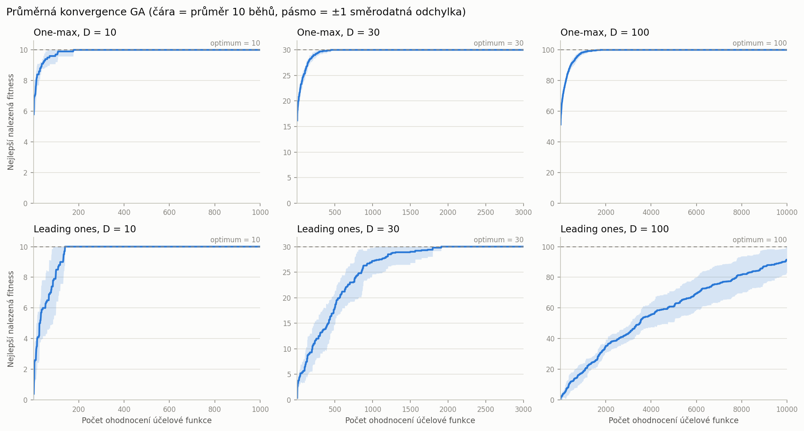
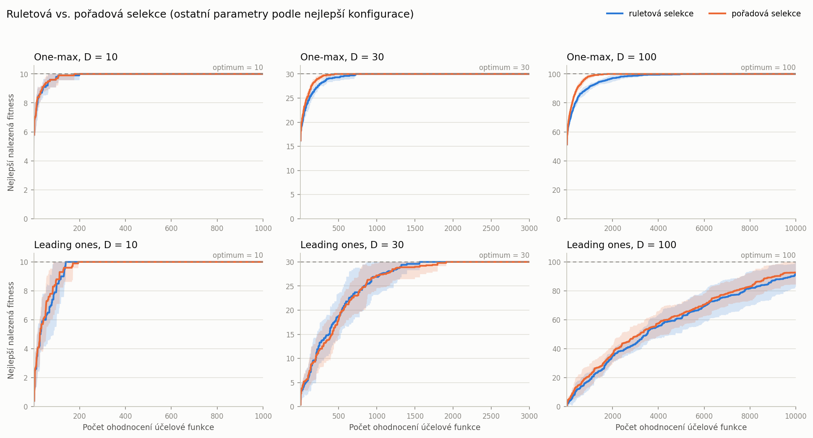

# Úloha 1 – Genetický algoritmus

Genetický algoritmus (GA) s binární reprezentací jedinců, elitismem, ruletovou/pořadovou selekcí, jednobodovým křížením a bitovou mutací. Algoritmus je otestován na úlohách **One-max** a **Leading ones** v dimenzích 10, 30 a 100 s rozpočtem **100·D ohodnocení účelové funkce** (1 000, 3 000 a 10 000).

- [Struktura řešení](#struktura-řešení)
- [Spuštění](#spuštění)
- [Implementace](#implementace)
- [Ladění parametrů](#ladění-parametrů)
- [Výsledky](#výsledky)
- [Závěr](#závěr)

## Struktura řešení

```
01-genetic-algorithm/
├── main.py              # vstupní bod (CLI): ladění parametrů a finální experimenty
├── ga/                  # samotný algoritmus – nezávisí na konkrétních úlohách ani experimentech
│   ├── config.py        # GAConfig – řídicí parametry algoritmu
│   ├── algorithm.py     # GeneticAlgorithm – generační cyklus s elitismem
│   ├── selection.py     # ruletová a pořadová selekce
│   ├── crossover.py     # jednobodové (+ dvoubodové a uniformní pro srovnání) křížení
│   ├── mutation.py      # bitová mutace
│   └── evaluator.py     # BudgetedEvaluator – hlídá rozpočet ohodnocení, zaznamenává konvergenci
├── problems/            # účelové funkce
│   ├── base.py          # rozhraní Problem
│   ├── onemax.py        # One-max
│   └── leading_ones.py  # Leading ones
├── experiments/         # vše kolem algoritmu
│   ├── runner.py        # opakované nezávislé běhy
│   ├── statistics.py    # statistiky (nejlepší, nejhorší, průměr, medián, sm. odchylka, …)
│   ├── tuning.py        # grid search řídicích parametrů
│   ├── plotting.py      # konvergenční grafy
│   └── tables.py        # export tabulek do CSV a Markdownu
├── tests/               # jednotkové testy (pytest)
└── results/             # vygenerované výsledky (grafy, tabulky, zvolené konfigurace)
```

Balíček `ga` pracuje s libovolnou účelovou funkcí, která má atribut `dim` a metodu `evaluate(population)`. Operátory selekce a křížení jsou v registrech (`SELECTIONS`, `CROSSOVERS`) a v konfiguraci se volí názvem.

## Spuštění

Z kořene repozitáře (virtuální prostředí je popsáno v [hlavním README](../README.md)):

```bash
python 01-genetic-algorithm/main.py all    # ladění parametrů + finální experimenty (~3 min na 8 jádrech)
python 01-genetic-algorithm/main.py tune   # jen ladění -> results/tuning/, results/best_configs.json
python 01-genetic-algorithm/main.py run    # jen finální běhy s nejlepšími konfiguracemi -> grafy a statistiky
python -m pytest 01-genetic-algorithm/tests
```

Volitelné parametry: `--runs` (počet běhů ve finálním experimentu, výchozí 10), `--tuning-runs` (počet běhů na konfiguraci při ladění, výchozí 30), `--seed` (výchozí 42) a `--jobs` (počet procesů). Výsledky jsou díky pevným semínkům reprodukovatelné.

## Implementace

**Reprezentace.** Populace je matice `N × D` hodnot 0/1 (`numpy.uint8`). Všechny operátory pracují nad celou populací najednou (vektorizovaně).

**Jedna generace** ([`ga/algorithm.py`](ga/algorithm.py)):

1. **Elitismus:** `round(elite_ratio · N)` nejlepších jedinců (při zapnutém elitismu alespoň 1) se přesune do nové populace beze změny. Jejich fitness je známá, znovu se nevyhodnocuje.
2. **Selekce:** vybere se potřebný počet dvojic rodičů (ruletová nebo pořadová selekce).
3. **Křížení:** s pravděpodobností `pc` se rodiče zkříží, jinak jsou potomci jejich kopiemi.
4. **Mutace:** potomci se projdou bit po bitu a každý bit se s pravděpodobností `pm` invertuje.
5. Potomci se ohodnotí a doplní novou populaci na velikost `N`. Při lichém počtu volných míst se druhý potomek poslední dvojice zahodí.

**Selekce** ([`ga/selection.py`](ga/selection.py)):
- *Ruletová:* `P(i) = f_i / Σ f`. Pokud mají všichni jedinci fitness 0 (u Leading ones na začátku běžné), vybírá se rovnoměrně.
- *Pořadová:* jedinci se seřadí, nejhorší má pořadí 1, nejlepší `N`, a `P(i) ~ pořadí`. Jedinci se stejnou fitness sdílí průměr svých pořadí, takže mají stejnou šanci.
- Rodiče se losují nezávisle (s vracením) pro všechny dvojice najednou, což je statisticky totéž jako postupný výběr dvojic.

**Křížení** ([`ga/crossover.py`](ga/crossover.py)): operátor určí masku genů, které se mezi rodiči vymění:
- *jednobodové* (dle zadání): náhodný bod řezu `1 … D−1`, první části řetězců se zamění;
- *dvoubodové* a *uniformní*: doplněny, aby šlo porovnat i typ křížení.

**Počítání ohodnocení a konvergence** ([`ga/evaluator.py`](ga/evaluator.py)): `BudgetedEvaluator` počítá každé vyhodnocení jednoho jedince (včetně počáteční populace) a nedovolí rozpočet překročit. Poslední generace se případně zkrátí. Po každém ohodnocení zaznamená dosud nejlepší fitness, takže každý běh dá křivku délky přesně 100·D a křivky 10 běhů lze přímo průměrovat.

**Statistiky** ([`experiments/statistics.py`](experiments/statistics.py)) se počítají z nejlepší nalezené fitness na konci každého běhu: nejlepší, nejhorší, průměr, medián a výběrová směrodatná odchylka (`ddof = 1`). Navíc počet běhů, které dosáhly optima, a průměrný počet ohodnocení do nalezení optima.

## Ladění parametrů

Grid search ([`experiments/tuning.py`](experiments/tuning.py)) zkouší všechny kombinace:

| Parametr | Hodnoty |
|---|---|
| velikost populace `N` | 5, 10, 20, 50, 100 |
| podíl elitismu | 10 %, 20 % |
| selekce | ruletová, pořadová |
| křížení | jednobodové, dvoubodové, uniformní |
| pravděpodobnost křížení `pc` | 0.8, 1.0 |
| pravděpodobnost mutace `pm` | 0.005, 0.01, 1/D |

- Konfigurace, které se chovají identicky, se vyhodnocují jen jednou. Například pro D = 100 platí 1/D = 0.01 a pro N = 5 dává 10 % i 20 % elitismu jednoho elitního jedince.
- Každá konfigurace běží **30×** na každé ze 6 instancí, celkem 1 728 dvojic (instance, konfigurace) a přes 50 000 běhů.
- Konfigurace se řadí podle průměrné finální fitness a při shodě podle normalizované plochy pod konvergenční křivkou (AUC ∈ [0, 1]; vyšší znamená rychlejší konvergenci).
- Ladění používá jiná semínka než finální běhy, takže výsledné statistiky nejsou měřeny na stejných bězích, na kterých byla konfigurace vybrána.

### Vliv jednotlivých parametrů

Průměrná AUC přes všechny konfigurace s danou hodnotou parametru (vyšší = lepší):

| Parametr | Hodnota | One-max 10D | One-max 30D | One-max 100D | Leading ones 10D | Leading ones 30D | Leading ones 100D |
|---|---|---|---|---|---|---|---|
| N | 5 | 0.965 | **0.975** | **0.978** | 0.802 | 0.713 | **0.514** |
| N | 10 | 0.975 | 0.973 | 0.969 | 0.846 | 0.708 | 0.493 |
| N | 20 | **0.981** | 0.972 | 0.966 | 0.897 | **0.721** | 0.47 |
| N | 50 | 0.975 | 0.961 | 0.952 | **0.918** | 0.667 | 0.387 |
| N | 100 | 0.967 | 0.939 | 0.93 | 0.911 | 0.613 | 0.313 |
| Elitismus | 10 % | 0.972 | 0.961 | 0.954 | 0.875 | 0.682 | 0.427 |
| Elitismus | 20 % | 0.973 | 0.967 | 0.964 | 0.874 | 0.687 | 0.444 |
| Selekce | ruletová | 0.97 | 0.956 | 0.945 | 0.874 | 0.677 | 0.415 |
| Selekce | pořadová | **0.975** | **0.972** | **0.973** | 0.875 | **0.692** | **0.455** |
| Křížení | jednobodové | 0.971 | 0.96 | 0.954 | 0.867 | 0.648 | 0.409 |
| Křížení | dvoubodové | 0.972 | 0.963 | 0.957 | 0.873 | 0.672 | 0.415 |
| Křížení | uniformní | **0.975** | **0.968** | **0.966** | **0.883** | **0.732** | **0.482** |
| pc | 0.8 | 0.972 | 0.963 | 0.958 | 0.872 | 0.678 | 0.432 |
| pc | 1.0 | 0.973 | 0.965 | 0.96 | 0.878 | 0.69 | 0.439 |
| pm | 0.005 | 0.965 | 0.961 | 0.959 | 0.809 | 0.574 | 0.371 |
| pm | 0.01 | 0.974 | 0.966 | 0.959 | 0.876 | 0.693 | 0.467 |
| pm | 1/D | **0.979** | 0.965 | 0.959 | **0.938** | **0.785** | 0.467 |

(Vygenerováno do [`results/tuning/parameter_effects.md`](results/tuning/parameter_effects.md). Kompletní žebříčky všech konfigurací jsou v [`results/tuning/*.csv`](results/tuning/), top 5 pro každou instanci v [`results/tuning/top_configs.md`](results/tuning/top_configs.md).)

**Pozorování:**

- **Velikost populace má největší vliv.** Při pevném rozpočtu 100·D ohodnocení znamená malá populace více generací. U One-max 100D a Leading ones 100D je v průměru nejlepší N = 5 a s rostoucím N výsledky výrazně klesají (LO 100D: AUC 0.514 pro N = 5 vs. 0.313 pro N = 100).
- **Velikost populace a mutace se vzájemně ovlivňují.** U Leading ones 10D je v průměru lepší větší populace, protože malá populace s nízkou mutací (0.005) rychle ztratí diverzitu a uvízne. S pm = 1/D je malá populace opět nejlepší (AUC 0.956 pro N = 5 vs. 0.913 pro N = 100).
- **Mutace pm = 1/D** (v průměru jeden převrácený bit na potomka) je nejlepší nebo shodná s nejlepší. Nízká mutace 0.005 je horší hlavně u Leading ones. Pro D = 10 a 30 je 1/D = 10 % resp. 3.3 %, tedy nad doporučeným rozsahem 0.5–1 %. Ten odpovídá 1/D až pro D ≈ 100–200.
- **Pořadová selekce je robustnější než ruletová.** U One-max mají jedinci v pozdní fázi podobnou fitness (např. 90 vs. 95), takže ruleta vybírá téměř rovnoměrně a selekční tlak mizí. Pořadová selekce závisí jen na pořadí, a tlak proto drží. V nejlepších konfiguracích jsou však rozdíly v rámci šumu a ruleta občas vyhraje (viz [srovnání selekcí](#srovnání-selekcí)).
- **Uniformní křížení** vychází empiricky nejlépe, nejvíce u Leading ones 30D (AUC 0.732 vs. 0.648 u jednobodového). U nejlepších konfigurací jsou rozdíly malé, jednobodové křížení je v top 5 u One-max 10D.
- **Podíl elitismu (10 vs. 20 %) a pc (0.8 vs. 1.0)** mají zanedbatelný vliv: rozdíly v AUC jsou do 0.02.

### Zvolené nastavení

Nejlepší konfigurace pro každou instanci ([`results/best_configs.json`](results/best_configs.json)):

| Úloha | D | N | Elitismus | Selekce | Křížení | pc | pm |
|---|---|---|---|---|---|---|---|
| One-max | 10 | 5 | 10 % (1 jedinec) | pořadová | uniformní | 0.8 | 1/D = 0.1 |
| One-max | 30 | 10 | 20 % | pořadová | uniformní | 1.0 | 1/D ≈ 0.033 |
| One-max | 100 | 10 | 20 % | pořadová | uniformní | 1.0 | 0.01 = 1/D |
| Leading ones | 10 | 5 | 10 % (1 jedinec) | ruletová | uniformní | 1.0 | 1/D = 0.1 |
| Leading ones | 30 | 5 | 10 % (1 jedinec) | pořadová | uniformní | 1.0 | 1/D ≈ 0.033 |
| Leading ones | 100 | 5 | 10 % (1 jedinec) | ruletová | uniformní | 1.0 | 0.01 = 1/D |

Nejlepší konfigurace se od dalších v žebříčku liší jen nepatrně. Například u Leading ones 100D má vítěz průměr 93.2 ± 8.4 a druhá konfigurace (N = 10, pořadová selekce) 92.6 ± 8.5. **Robustní obecné doporučení** pro tyto úlohy je proto: malá populace (5–20), 10–20 % elitismu, pořadová selekce, uniformní křížení s pc = 1 a pm = 1/D.

## Výsledky

10 nezávislých běhů pro každou instanci se zvolenou konfigurací (semínka 42–51). Tabulka je vygenerována do [`results/stats.md`](results/stats.md).

| Úloha | D | Ohodnocení | Nejlepší | Nejhorší | Průměr | Medián | Sm. odchylka | Optimum | Ohodnocení do optima (průměr) |
|---|---|---|---|---|---|---|---|---|---|
| One-max | 10 | 1000 | 10 | 10 | 10 | 10 | 0 | 10/10 | 79.8 |
| One-max | 30 | 3000 | 30 | 30 | 30 | 30 | 0 | 10/10 | 297.6 |
| One-max | 100 | 10000 | 100 | 100 | 100 | 100 | 0 | 10/10 | 1302.4 |
| Leading ones | 10 | 1000 | 10 | 10 | 10 | 10 | 0 | 10/10 | 100.3 |
| Leading ones | 30 | 3000 | 30 | 30 | 30 | 30 | 0 | 10/10 | 1236.6 |
| Leading ones | 100 | 10000 | 100 | 80 | 91.5 | 92 | 8.48 | 4/10 | 8602.5 |

„Ohodnocení do optima“ je průměr jen přes běhy, které optima dosáhly.

### Průměrné konvergenční grafy

Čára je průměr nejlepší dosud nalezené fitness přes 10 běhů, pásmo ukazuje ±1 směrodatnou odchylku.



Samostatné grafy: [One-max 10D](results/plots/onemax_10D.png), [One-max 30D](results/plots/onemax_30D.png), [One-max 100D](results/plots/onemax_100D.png), [Leading ones 10D](results/plots/leading_ones_10D.png), [Leading ones 30D](results/plots/leading_ones_30D.png), [Leading ones 100D](results/plots/leading_ones_100D.png).

### Srovnání selekcí

Nejlepší konfigurace každé instance spuštěná s ruletovou i pořadovou selekcí (ostatní parametry i semínka stejné):



U One-max (30D a 100D) konverguje pořadová selekce zřetelně rychleji, a to z důvodu popsaného výše (klesající selekční tlak rulety). U Leading ones jsou obě selekce srovnatelné. Pravděpodobně proto, že mutace bitu uvnitř úvodního bloku jedniček fitness potomka prudce sníží. Rozdíly ve fitness v populaci tak zůstávají velké a ruleta si selekční tlak udrží.

## Závěr

- **One-max** GA řeší spolehlivě ve všech dimenzích: optimum našel v 10/10 bězích a spotřeboval jen malou část rozpočtu (u D = 100 v průměru ~1 300 z 10 000 ohodnocení). To řádově odpovídá známé době běhu jednoduchých evolučních algoritmů na One-max (≈ e·n·ln n ≈ 1 250 pro n = 100).
- **Leading ones** je výrazně těžší. Zlepšení vyžaduje převrátit právě první nulový bit a přitom nepoškodit žádnou z úvodních jedniček, takže je potřeba řádově n² ohodnocení. Pro (1+1)-EA s pm = 1/n je očekávaná doba ≈ 0.86·n², tj. zhruba 8 600 ohodnocení pro n = 100. Rozpočet 10 000 ohodnocení je jen těsně nad touto hodnotou, a proto GA v dimenzi 100 dosáhl optima jen ve 4 z 10 běhů (průměr 91.5, medián 92). V dimenzích 10 a 30 optimum nachází vždy.
- Při malém rozpočtu (100·D) se nejlépe osvědčila malá populace, pm = 1/D a pořadová selekce. Podíl elitismu a pravděpodobnost křížení mají v testovaném rozsahu jen malý vliv.
